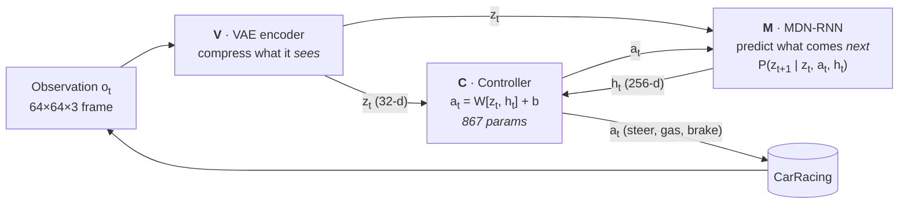

# 01 · World Models (Ha & Schmidhuber, 2018) — Car Racing

> **Paper:** David Ha, Jürgen Schmidhuber. *World Models.* NeurIPS 2018 / [arXiv:1803.10122](https://arxiv.org/abs/1803.10122) · [interactive version](https://worldmodels.github.io/)

A from-scratch PyTorch reimplementation of the paper's **CarRacing** experiment. It uses the same three components, trained the same way: **one at a time, each with its own script**. It runs on a laptop CPU or an Apple-silicon GPU (MPS), with no CUDA GPU needed.

---

## 1. The idea in one picture



The agent's "brain" is split in three, and **almost all of the capacity sits in the world model (V + M)**:

| Model | Role | Architecture | Trained with | Params |
|---|---|---|---|---|
| **V** – Vision | Compresses each frame into a latent code **z** | Conv VAE, z = 32 | Gradient descent, L2 recon + KL, unsupervised | ~4.3 M |
| **M** – Memory | Learns how **z** evolves; **h** holds its prediction of the future | LSTM 256 + Mixture Density Network (5 Gaussians) | Gradient descent, NLL of z<sub>t+1</sub> | ~0.4 M |
| **C** – Controller | Maps [z, h] to an action | **A single linear layer** | **CMA-ES** (evolution), reward only | **867** |

Because C is tiny, it can be trained with an evolution strategy using only the total reward. Credit assignment over long horizons is handled by the representations V and M have already learned.

## 2. Code map

```
01-world-models-2018/
├── README.md
├── pyproject.toml          # package metadata + dependencies (pip install -e .)
├── run_all.sh              # whole pipeline in order (./run_all.sh laptop 4 = resume from step 4)
├── worldmodels/            # the library
│   ├── vae.py              # V: ConvVAE + loss (L2 + KL with free bits)
│   ├── mdrnn.py            # M: LSTM + MDN head, mixture NLL, temperature sampling
│   ├── controller.py       # C: linear policy, 867 params
│   ├── agent.py            # V+M+C acting in the real env, episode loop
│   ├── env.py              # CarRacing, 96→64 px preprocessing, random exploration policy
│   ├── data.py             # streaming frame batches / latent-sequence batches
│   └── config.py           # "paper" and "laptop" hyper-parameter presets
├── scripts/                # one script per training stage
│   ├── 01_collect_data.py      # step 1  random rollouts      → data/rollouts/*.npz
│   ├── 02_train_vae.py         # step 2  train V               → checkpoints/vae.pt
│   ├── 03_encode_data.py       # step 3  frames → (μ, logσ²)    → data/series.npz
│   ├── 04_train_mdrnn.py       # step 4  train M               → checkpoints/mdrnn.pt
│   ├── 05_train_controller.py  # step 5  train C with CMA-ES   → runs/controller_zh/best.npy
│   ├── 06_evaluate.py          # step 6  score / watch / record the agent
│   └── visualize.py            # VAE reconstructions, MDN-RNN dreams, training curves
├── tools/                  # optional extras, not needed for training
│   ├── compare_videos.py   # two evaluation videos side by side (e.g. untrained vs trained)
│   └── ablation_video.py   # 2×2 video: which of V / M / C must be trained for the car to drive
└── data/ checkpoints/ runs/   # generated outputs (git-ignored)
```

## 3. Setup

```bash
cd 01-world-models-2018
uv venv --python 3.11 .venv          # or: python3.11 -m venv .venv
uv pip install --python .venv/bin/python -e .      # or: pip install -e .
source .venv/bin/activate
```

Run every command below **from this folder** (`01-world-models-2018/`); outputs go to `data/`, `checkpoints/` and `runs/`.

`gymnasium[box2d]` compiles Box2D, so you need `swig` (`brew install swig`).

## 4. Train each module yourself

Each step reads only the previous step's output, so you can stop, inspect and retrain any stage on its own. Every script takes `--preset laptop` (default) or `--preset paper`, and any single value can be overridden (`--help` lists them).

### Step 1 · Collect data (no learning)

```bash
python scripts/01_collect_data.py                    # 1,000 rollouts × 1,000 steps  (~13 min, ~1.1 GB)
python scripts/01_collect_data.py --preset paper     # 10,000 rollouts               (~2 h,  ~11 GB)
```

A random exploration policy drives the car. Frames are cropped to remove the dashboard and resized to 64×64.

### Step 2 · Train V, the VAE

```bash
python scripts/02_train_vae.py                       # 10 epochs, batch 100, Adam 1e-4, KL tolerance 0.5
```

It learns to compress frames, with no notion of actions or reward. Watch `runs/vae/epoch_XX.png` (top: input, bottom: reconstruction) improve epoch by epoch.

### Step 3 · Encode the dataset with the frozen V

```bash
python scripts/03_encode_data.py
```

### Step 4 · Train M, the MDN-RNN

```bash
python scripts/04_train_mdrnn.py                     # 4,000 steps, batch 100, sequences of 999, Adam 1e-3, grad-clip 1
```

M learns to predict the next latent z<sub>t+1</sub> from z<sub>t</sub> and a<sub>t</sub>. A fresh z ~ N(μ, σ) is sampled from the stored (μ, logσ²) each time a sequence is used, as in the paper.

### Step 5 · Train C, the controller, with CMA-ES

```bash
python scripts/05_train_controller.py                # full World Model: C sees [z, h]
python scripts/05_train_controller.py --mode z       # ablation: C sees z only (no memory)
python scripts/05_train_controller.py --resume       # continue an interrupted run
```

V and M are frozen. Each generation, CMA-ES samples a population of 867-dimensional parameter vectors. Each one drives the car on several tracks, played in parallel on all CPU cores. Only the average reward is fed back. Every few generations the CMA-ES mean is tested on unseen tracks; the best is saved to `runs/controller_zh/best.npy`.

### Step 6 · Evaluate and watch

```bash
python scripts/06_evaluate.py --episodes 100         # mean ± std over 100 unseen tracks (the paper's metric)
python scripts/06_evaluate.py --random               # baseline: untrained controller
python scripts/06_evaluate.py --episodes 3 --render  # watch it drive live
python scripts/06_evaluate.py --episodes 1 --video runs/drive.mp4   # game | VAE input | VAE reconstruction
python scripts/visualize.py vae | dream | curves
```

`scripts/visualize.py dream` gives the real episode the first 60 frames. After that, the MDN-RNN imagines the rest of the episode on its own (`--temperature` controls how wild the dream is).

## 5. Paper vs. laptop preset

The architectures and losses are **the same in both presets**. Only the data and compute budget changes.

| | Paper | Laptop (default) |
|---|---|---|
| Random rollouts | 10,000 | 1,000 |
| VAE | 10 epochs, batch 100, lr 1e-4 | same |
| MDN-RNN | 4,000 steps, batch 100, seq 999, lr 1e-3 | same |
| CMA-ES population × episodes/candidate | 64 × 16 | 32 × 4 |
| Training episodes cut early when off-track | no | after 100 steps without a new tile |
| Evaluation of CMA-ES mean | every 25 gens on 1,024 tracks | every 10 gens on 32 tracks |

**Paper results (CarRacing, 100 random trials):** V only, z → C: **632 ± 251** · V only + hidden layer: **788 ± 141** · **Full World Model, z + h → C: 906 ± 21**. CarRacing counts as "solved" at an average of 900.

### Differences from the original

- PyTorch + Gymnasium `CarRacing-v3` instead of TensorFlow + gym `CarRacing-v0`. Rewards and tracks are generated the same way, though the physics may differ slightly.
- **Exploration policy:** a smooth random walk over actions (steer/gas drift, occasional brakes). Uniform random actions make the car jitter in place. About 86% of the collected frames show the road.
- CMA-ES (via `pycma`) scores all candidates of a generation on the same random tracks (common random numbers), which makes comparisons between candidates less noisy.
- The laptop preset's early stopping applies only to training episodes. **All evaluation plays full 1,000-step episodes.**

## 6. Results on this laptop

*(Apple M4, 10 cores, 32 GB. Filled in after the run finishes.)*
